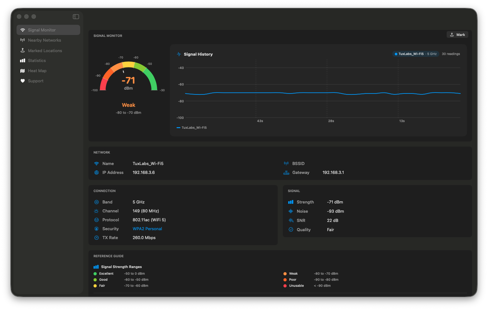
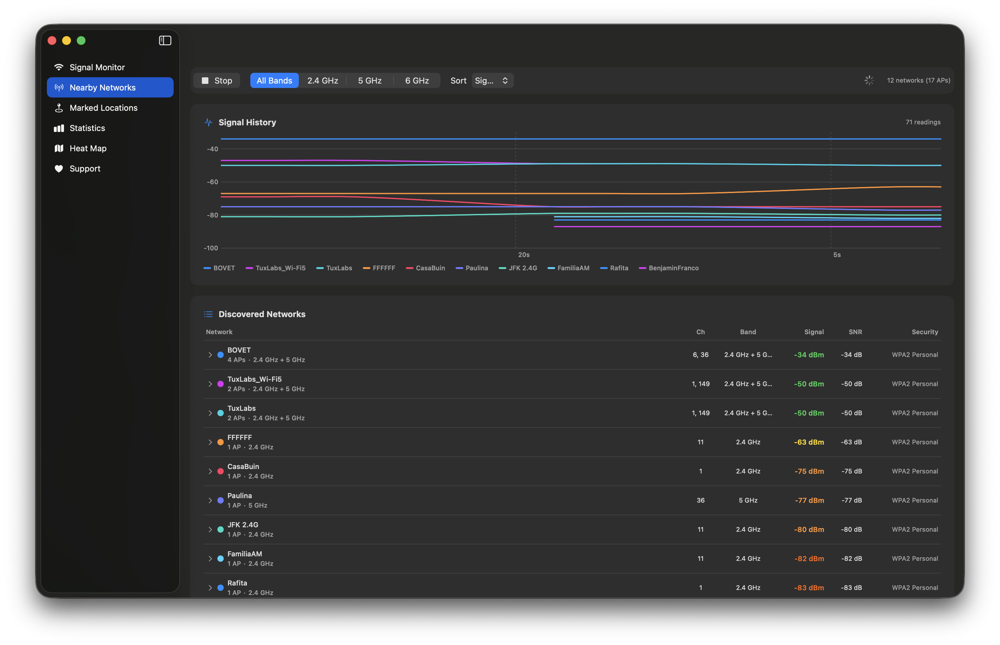
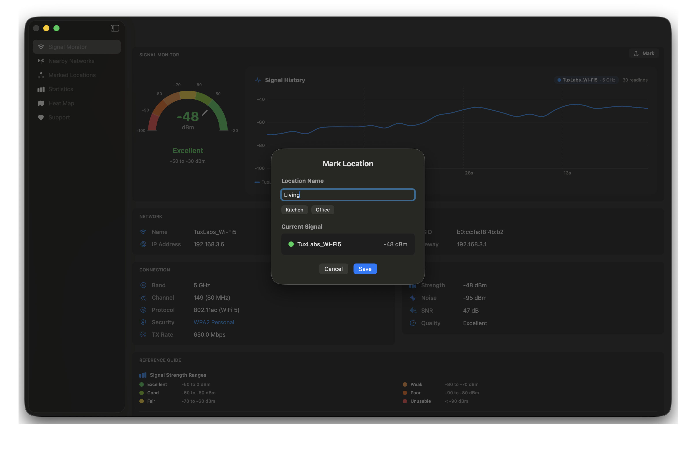

<p align="center">
  
</p>

<h1 align="center">AirMone</h1>

<p align="center">
  A free, open-source WiFi analyzer and signal mapper for macOS.
</p>

<p align="center">
  <a href="#features">Features</a> &bull;
  <a href="#installation">Installation</a> &bull;
  <a href="#building-from-source">Build</a> &bull;
  <a href="#architecture">Architecture</a> &bull;
  <a href="#contributing">Contributing</a> &bull;
  <a href="#license">License</a>
</p>

<p align="center">
  
  
  
  <a href="https://github.com/jbovet/AirMone/actions/workflows/ci.yml">
    
  </a>
</p>

---

AirMone is a native macOS utility built entirely with SwiftUI. It gives you real-time visibility into your wireless environment through interactive gauges, charts, heat maps, and detailed statistics — all without leaving your desktop.

## Features

### Signal Monitor

<p align="center">
  
</p>

- **Signal Gauge** — Semi-circle gauge with color-coded range segments (Unusable → Excellent), needle indicator, and dBm tick labels for instant signal assessment.
- **History Chart** — Tracks RSSI over time so you can observe fluctuations and correlate them with environmental changes.
- **Network Info** — Displays SSID, BSSID, IP address, gateway, band, channel, protocol, security, TX rate, noise, SNR, and signal quality at a glance.
- **Reference Guide** — Built-in quick reference for signal strength ranges, frequency bands, and router optimization tips.

### Nearby Networks

<p align="center">
  
</p>

- **Band Filtering** — Filter discovered networks by 2.4 GHz, 5 GHz, or 6 GHz.
- **SSID Grouping** — Access points sharing the same SSID are automatically grouped; expand any group to inspect individual BSSIDs.
- **Multiple Sort Orders** — Sort by signal strength, channel, or name.
- **Signal History** — Per-SSID signal tracking with color-coded chart lines (top 10 strongest networks).

### Location Mapping & Measurements

<p align="center">
  
</p>

- **Drop Pin** — Record signal strength at named locations within your space.
- **Persistent Storage** — Measurements are stored locally and survive app restarts.
- **CSV / JSON Export** — Export collected data for analysis in external tools.

### Signal Heat Map

- **IDW Interpolation** — Generates a continuous signal-strength surface from discrete measurement points using Inverse Distance Weighting.
- **Gaussian Smoothing** — Optional smoothing pass for cleaner visual output.
- **Drag-and-Drop Layout** — Position location pins on a canvas to match your physical floor plan.

### Statistics

- **Distribution Analysis** — View signal quality distribution across all measurements.
- **Per-Location Metrics** — Average RSSI, measurement count, and strength per location.
- **Per-SSID Metrics** — Track performance across different networks.

## Installation

1. **Download**: Get the latest `.dmg` from the [Releases](https://github.com/jbovet/AirMone/releases) page.
2. **Install**: Open the `.dmg` and drag **AirMone** to your **Applications** folder.
3. **First Launch (Required)**:
   - Go to your **Applications** folder.
   - **Right-click** (or Control-click) **AirMone** and select **Open**.
   - Click **Open** in the confirmation dialog.

#### Alternative Method (via System Settings)
If the right-click method doesn't work:
1. Try to open **AirMone** normally (it will fail and show a warning).
2. Open the **Apple menu**  > **System Settings**.
3. Click **Privacy & Security** in the sidebar.
4. Scroll down to the **Security** section.
5. You should see a message about "AirMone" being blocked. Click **Open Anyway**.
6. Enter your login password and click **OK**.

> [!TIP]
> These steps are only necessary for the first launch. Subsequent launches can be done normally via Spotlight or Launchpad.

### Requirements

| Requirement | Minimum |
|---|---|
| macOS | 14.0 (Sonoma) |
| Xcode | 15.0+ (for building) |
| Permissions | Location Services must be enabled for WiFi scanning |

> **Note:** macOS requires Location Services authorization for apps that access WiFi network information via CoreWLAN. You will be prompted on first launch.

## Building from Source

```bash
# Clone the repository
git clone https://github.com/jbovet/AirMone.git
cd AirMone

# Open in Xcode
open WiFiAnalyzer.xcodeproj

# Or build from the command line
xcodebuild -scheme WiFiAnalyzer -destination 'platform=macOS' build
```

Select the **WiFiAnalyzer** scheme, choose a macOS destination, and press **Cmd + R**.

### Running Tests

```bash
xcodebuild test -project WiFiAnalyzer.xcodeproj \
  -scheme WiFiAnalyzer \
  -destination 'platform=macOS'
```

Test coverage includes:

| Test Suite | Scope |
|---|---|
| `SignalStrengthTests` | RSSI-to-category mapping, colors, percentages |
| `NearbyNetworksTests` | Network grouping, filtering, ViewModel state |
| `PersistenceServiceTests` | Local data storage and retrieval |
| `HeatMapInterpolatorTests` | IDW interpolation correctness |
| `ExportServiceTests` | CSV and JSON export output |
| `StatisticsViewModelTests` | Aggregation and distribution calculations |
| `LocationMappingServiceTests` | Grid layout and coordinate mapping |
| `LocationCoordinateTests` | Coordinate model validation |


## Architecture

AirMone follows the **MVVM** (Model-View-ViewModel) pattern:

```
WiFiAnalyzer/
├── Models/              # Data models (WiFiNetwork, SignalStrength, etc.)
├── ViewModels/          # Observable state management
├── Views/               # SwiftUI views organized by feature
│   ├── Dashboard/       # Signal gauge, history chart, network info
│   ├── NearbyNetworks/  # Network list with grouping and filtering
│   ├── Measurements/    # Location-based measurements
│   ├── HeatMap/         # Signal heat map visualization
│   └── Statistics/      # Statistical analysis views
├── Services/            # Business logic and system integration
│   ├── WiFiScannerService    # CoreWLAN wrapper
│   ├── PersistenceService    # Local data storage
│   ├── ExportService         # CSV/JSON export
│   ├── HeatMapInterpolator   # IDW interpolation
│   └── LocationMappingService # Coordinate management
└── Helpers/             # Utilities (color palette, etc.)
```

**Key frameworks:** SwiftUI, CoreWLAN, CoreLocation, Charts, SystemConfiguration.

## Contributing

Contributions are welcome! Please read the [Contributing Guidelines](CONTRIBUTING.md) before opening a pull request.

## Author

**Jose Bovet Derpich** — [jose.bovet@gmail.com](mailto:jose.bovet@gmail.com)

- GitHub: [@jbovet](https://github.com/jbovet)

## License

This project is licensed under the MIT License — see the [LICENSE](LICENSE) file for details.
